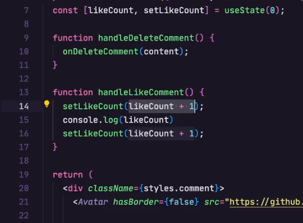
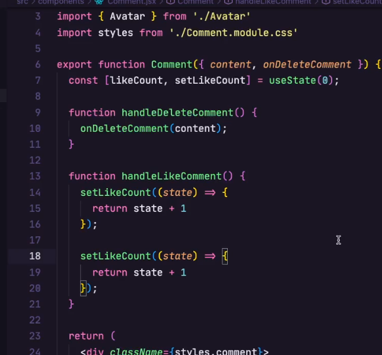

# Closures no React



Toda vez que a função é executada é criado um novo escopo, e esse escopo tem acesso a variável `count` que foi declarada no escopo anterior. Isso é um closure.

```jsx
function Counter() {
  let count = 0;

  function increment() {
    count++;
    console.log(count);
  }

  return <button onClick={increment}>{count}</button>;
}
```


